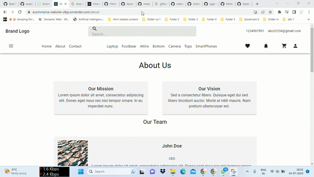

# ecommerce-website
Welcome to Ecommerce Platform! Our robust and user-friendly platform offers a comprehensive shopping experience for users, seamless product management for sellers, and powerful administrative tools for administrators. With features such as secure user registration and authentication, intuitive product catalog and search, efficient shopping cart and checkout, advanced order management, and interactive rating and reviews, Ecommerce Platform empowers buyers, sellers, and administrators alike. Enjoy a seamless ecommerce journey with a responsive design, top-notch security, and a range of convenient features.

# Detail of Content

  
Table of Contents

  <ol>
    <li><a href="#introduction">Introduction</a></li>
    <li><a href="#key-features">Key Features</a></li>
    <li><a href="#visual">Visual</a></li>
    <li><a href="#technology-used">Technology Used</a></li>
    <li><a href="#installation-and-usage">Installation and Usage</a></li>
    <li><a href="#contributing-guidelines">Contributing Guidelines</a></li>
    <li><a href="#roadmap-and-future-plans">Roadmap and Future Plans</a></li>
    <li><a href="#license">License</a></li>
    <li><a href="#contact-information">Contact Information</a></li>
  </ol>

# Introduction
Welcome to Ecommerce Platform, the ultimate destination for a seamless and comprehensive online shopping experience. Our platform caters to users, sellers, and administrators, providing them with powerful tools and features to create a thriving ecommerce ecosystem.

For users, our platform offers a secure and streamlined registration process. Creating an account is quick and easy, allowing users to access personalized features such as saved preferences, order tracking, and seamless checkout. We prioritize user authentication, ensuring that their personal information is protected at all times.

Sellers benefit from our intuitive product management tools. They can easily list their products, add captivating descriptions, and showcase images to attract buyers. Our platform offers a dedicated seller dashboard where sellers can efficiently manage inventory, track orders, and communicate with customers. Real-time analytics and insights enable sellers to make informed decisions to drive sales and grow their business.

Administrators have access to a comprehensive set of tools to manage the entire ecommerce platform. From user management and content moderation to order processing and system settings, our admin panel empowers administrators to ensure a smooth and secure operation. They can verify seller accounts, monitor user activity, and maintain the integrity of the platform.

At Ecommerce Platform, we prioritize user experience and convenience. Our responsive design ensures seamless browsing and shopping from any device. With advanced search and filtering options, users can easily find the products they desire and explore a wide range of categories.

Join us on Ecommerce Platform and unlock a world of endless possibilities. Whether you're a buyer, seller, or administrator, our platform has you covered. Embrace the future of online shopping and embark on a remarkable ecommerce journey with us.

## Key Features

## Visual

## Technology Used

## Installation and Usage

## Contributing Guidelines

## Roadmap and Future Plans

## License

## Contact Information
